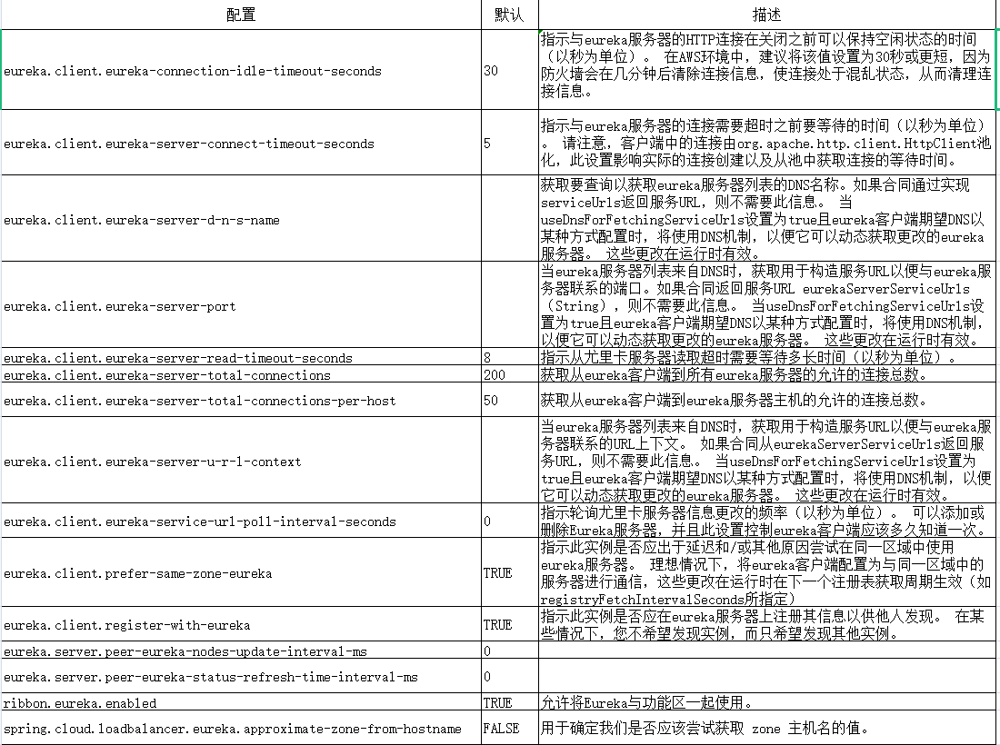

# 1，配置
## 1.1，配置服务名
spring.application.name=eureka-server
## 1.2.配置服务端口
server.port=8761
## 1.3，由于该应用为注册中心, 所以设置为false, 代表不向注册中心注册自己
eureka.client.register-with-eureka=false
## 1.4，由于注册中心的职责就是维护服务实例, 它并不需要去检索服务, 所以也设置为 false
eureka.client.fetch-registry=false
## 1.5，由于注册中心的职责就是维护服务实例, 它并不需要去检索服务, 所以服务端eureka-server不配置
eureka.client.serviceUrl.defaultZone=http://localhost:8761/eureka/  

# 2，引用
spring-cloud-starter-netflix-eureka-server

# 3，添加注解
@EnableEurekaServer

